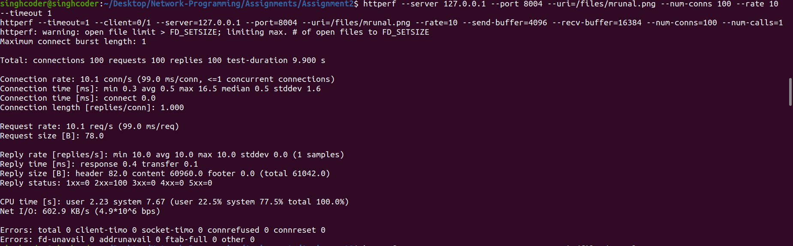
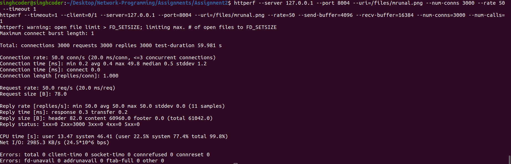
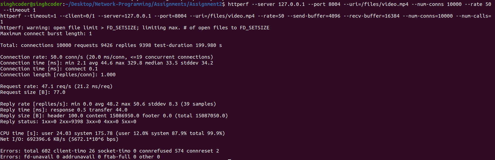

# Concurrent Webserver

### Task Requirement:
Write a program [webserver.c](./webserver.c) using threads and sockets supporting HTTP GET requests which works in
the following way:
- It creates a pool of threads in the beginning
- Main thread waits on `epoll_wait` for any I/O on sockets
- It stores the requests in a message queue used by all the threads.
- Each client is supposed to go through following stages
    - READING_REQUEST
    - HEADER_PARSING
    - READING_DISKFILE
    - WRITING_HEADER
    - WRITING_BODY
- After WRITING_HEADER stage, client cycles between READING_DISKFILE and WRITING_BODY stage until full file is transferred
- Connection is not closed until server receives an EOF (i.e. client itself has closed the connection).
- I/O on sockets is non blocking, but reading from file is blocking since it'll always succeed.

### Server performance

Testing is done using `httpref` which can be installed via `sudo apt install httpref`

Some snapshots for the statistics can be found here :

1. Number of connections : 100, Rate : 10, File size : 1450 bytes

2. Number of connections : 3000, Rate : 50, File size : 1450 bytes

3. Number of connections : 10000, Rate : 50, File size : 1509793 bytes (15.1 MB)

### Demo Run

### Dependencies:
- Linux kernal v4.15.0 (or higher)

